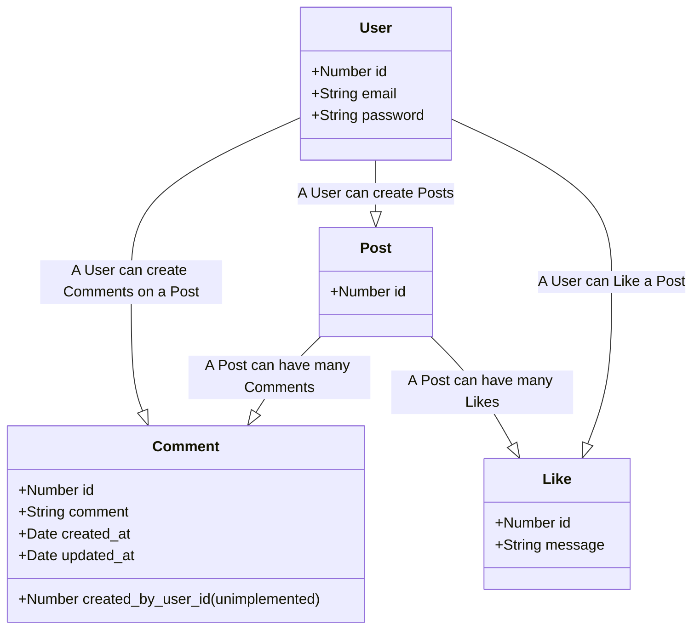
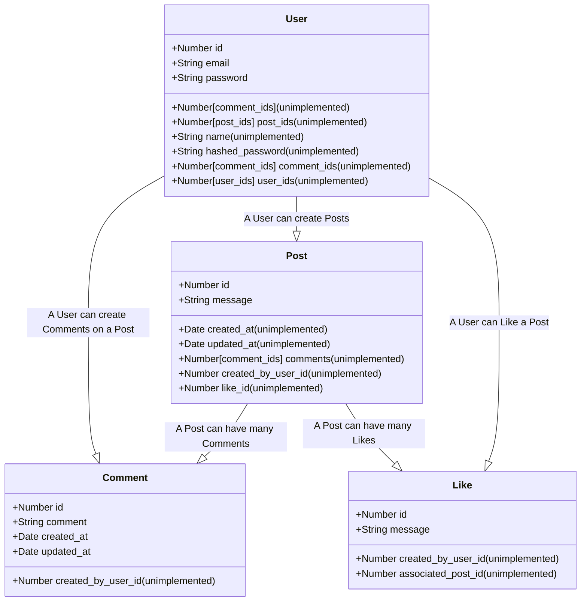

## Current status on the backend

```mermaid
classDiagram
class Post 
class Comment
class User
class Like


Post --|> Comment: A Post can have many Comments 
Post --|> Like: A Post can have many Likes
User --|> Comment: A User can create Comments on a Post
User --|> Post: A User can create Posts
User --|> Like: A User can Like a Post

class Post {
+Number id
}

class Like {
+Number id
+String message
}
class User {
+Number id
+String email
+String password
}
class Comment {
+Number id
+String comment
+Number created_by_user_id(unimplemented)
+Date created_at
+Date updated_at
}
```
possibities

```mermaid
classDiagram
class Post 
class Comment
class User
class Like


Post --|> Comment: A Post can have many Comments 
Post --|> Like: A Post can have many Likes
User --|> Comment: A User can create Comments on a Post
User --|> Post: A User can create Posts
User --|> Like: A User can Like a Post

class Post {
+Number id
+String message
+Date created_at(unimplemented)
+Date updated_at(unimplemented)
+Number[comment_ids] comments(unimplemented)
+Number created_by_user_id(unimplemented)
+Number like_id(unimplemented)
}

class Like {
+Number id
+String message
+Number created_by_user_id(unimplemented)
+Number associated_post_id(unimplemented)
}
class User {
+Number id
+String email
+String password
+Number[comment_ids] (unimplemented)
+Number[post_ids] post_ids(unimplemented)
+String name(unimplemented)
+String hashed_password(unimplemented)
+Number[comment_ids] comment_ids(unimplemented)
+Number[user_ids] user_ids(unimplemented)
}
class Comment {
+Number id
+String comment
+Number created_by_user_id(unimplemented)
+Date created_at
+Date updated_at
}
```