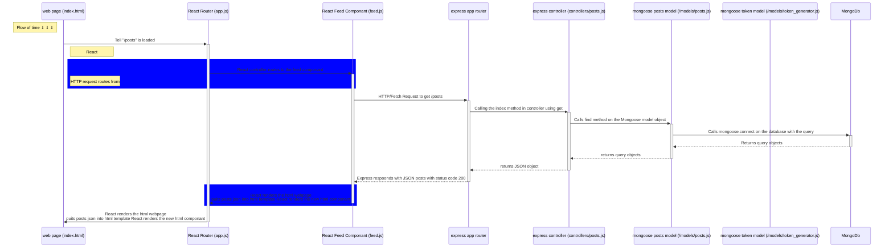

## A user requesting posts

```mermaid
sequenceDiagram
participant w as web page (index.html)
participant r as React Router (app.js)
participant rfc as React Feed Componant (feed.js)
participant exr as express app router
participant exc as express controller (controllers/posts.js)
participant mg as mongoose posts model (/models/posts.js)
participant tmg as mongoose token model (/models/token_generator.js)
participant mdb as MongoDb


note left of w: Flow of time  ⇓ ⇓ ⇓ 


w->>+r: Tell "/posts" is loaded
note right of w: React
rect rgb(0, 4, 255)


r->>+rfc: React controller routes to the feed componant

note right of w: HTTP request routes from 
end
rfc->>+exr: HTTP/Fetch Request to get /posts
exr->>+exc: Calling the index method in controller using get
exc->>+mg: Calls find method on the Mongoose model object
mg->>+mdb: Calls mongoose.connect on the database with the query
mdb-->>-mg: Returns query objects
mg-->>-exc: returns query objects
exc-->>-exr: returns JSON object 
exr-->>-rfc: Express respoonds with JSON posts with status code 200
rect rgb(0, 4, 255)
rfc->>-r: React renders the html webpage <br> puits posts json into html template React renders the new html componant
end
r->>-w: React renders the html webpage <br> puits posts json into html template React renders the new html componant
```