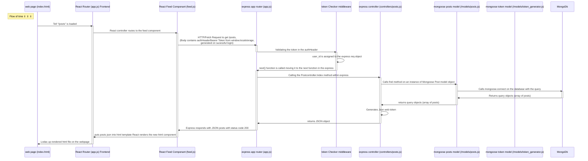

## A user requesting posts

```mermaid
sequenceDiagram
participant w as web page (index.html)
participant r as React Router (app.js) Frontend
participant rfc as React Feed Componant (feed.js)
participant exr as express app router (app.js)
participant tr as token Checker middleware
participant exc as express controller (controllers/posts.js)
participant mg as mongoose posts model (/models/posts.js)
participant tmg as mongoose token model (/models/token_generator.js)
participant mdb as MongoDb

note left of w: Flow of time  ⇓ ⇓ ⇓ 
w->>r: Tell "/posts" is loaded
activate r

r->>rfc: React controller routes to the feed component
activate rfc
rfc->>exr: HTTP/Fetch Request to get /posts,<br>(Body contains authHeaderBearer Token from window.localstorage,<br>generated on sucessful login)
activate exr
exr->>tr: Validating the token in the authHeader 
activate tr
deactivate exr
tr->>tr: user_id is assigned to the express req object 
tr->>exr: next() function is called moving it to the next function in the express
activate exr
deactivate tr
exr->>exc: Calling the Postcontroller.Index method within express
activate exc
exc->>mg: Calls find method on an instance of Mongoose Post model object
activate mg
mg->>mdb: Calls mongoose.connect on the database with the query
activate mdb
mdb->>-mg: Returns query objects (array of posts)
mg->>-exc: returns query objects (array of posts)
exc->>exc: Generates Json web token
exc->>-exr: returns JSON object 
exr->>-rfc: Express responds with JSON posts with status code 200

rfc->>-r: puts posts json into html template React renders the new html component

r->>-w: Lodas up rendered html file on the webpage
```