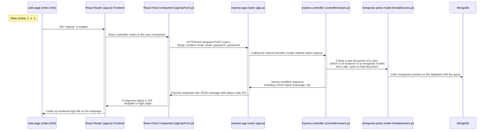

## A user requesting posts

```mermaid
sequenceDiagram
participant w as web page (index.html)
participant r as React Router (app.js) Frontend
participant rfc as React Feed Component (signUpForm.js)
participant exr as express app router (app.js)
participant exc as express controller (controllers/users.js)
participant mg as mongoose posts model (/models/users.js)
participant mdb as MongoDb

note left of w: Flow of time  ⇓ ⇓ ⇓ 
w->>r: Tell "/signup" is loaded
activate r
r->>rfc: React controller routes to the user component
activate rfc
rfc->>exr: HTTP/Fetch Request POST /users,<br>(Body contains email: email, password: password)
activate exr
exr->>exc: Calling the UsersController.Create method within express
activate exc
exc->>mg: Create a new document of a User,<br>(which is an instance of a mongoose model)<br> then calls .save on that document           
activate mg
mg->>mdb: Calls mongoose.connect on the database with the query
activate mdb
 
exc->>-exr: returns modified response <br>including JSON object {message: ok}
exr->>-rfc: Express responds with JSON message with status code 201
 
rfc->>-r: If response status is 201 <br> .navigate to login page

r->>-w: Loads up rendered login file on the webpage
```